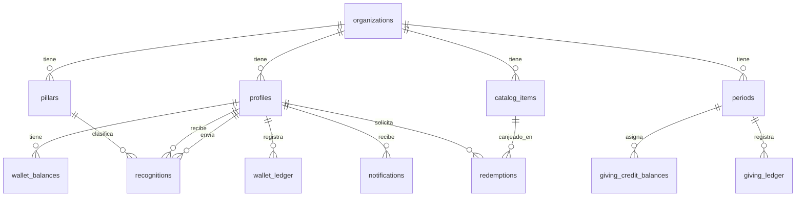

# ERD

```mermaid
erDiagram
  organizations ||--o{ profiles : tiene
  organizations ||--o{ pillars : tiene
  organizations ||--o{ periods : tiene
  organizations ||--o{ catalog_items : tiene
  profiles ||--o{ recognitions : envia
  profiles ||--o{ recognitions : recibe
  periods ||--o{ giving_credit_balances : asigna
  periods ||--o{ giving_ledger : registra
  profiles ||--o{ wallet_balances : tiene
  profiles ||--o{ wallet_ledger : registra
  catalog_items ||--o{ redemptions : canjeado_en
  profiles ||--o{ redemptions : solicita
  profiles ||--o{ notifications : recibe
  pillars ||--o{ recognitions : clasifica
```

Detalle de columnas en `docs/DATA_MODEL.md` y en las migraciones SQL.
